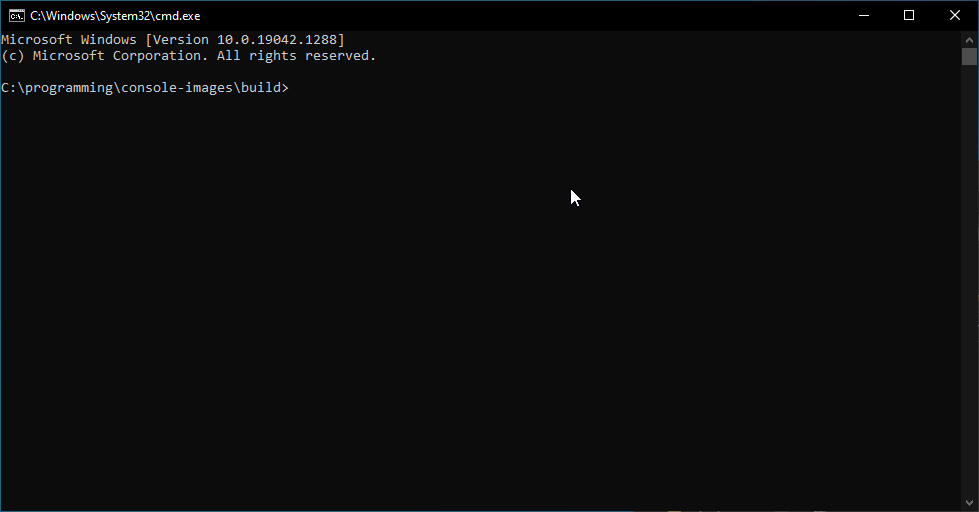

# Console Images

## Description

A program to render images and animated GIFs in windows cmd.exe. Something that I have wanted to attempt for a long time.

## Images



## Building

Uses CMake:
```
mkdir build && cd build
cmake ..
```

## Usage

Run the program `ConsoleImages.exe` in your cmd.exe window, it should not disrupt your ability to run further commands. Any time you type [img=path] the program will automatically replace the text with the image linked.

## Future Work

- Proof of concepts for rendering GL and Vulkan in the console
- Rendering videos in the console

